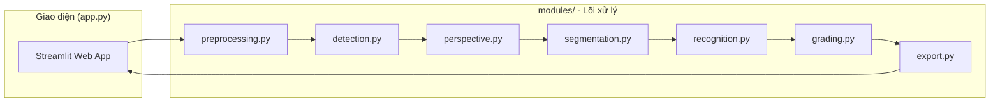
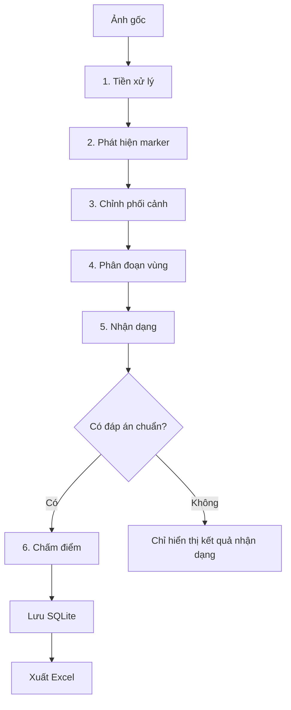
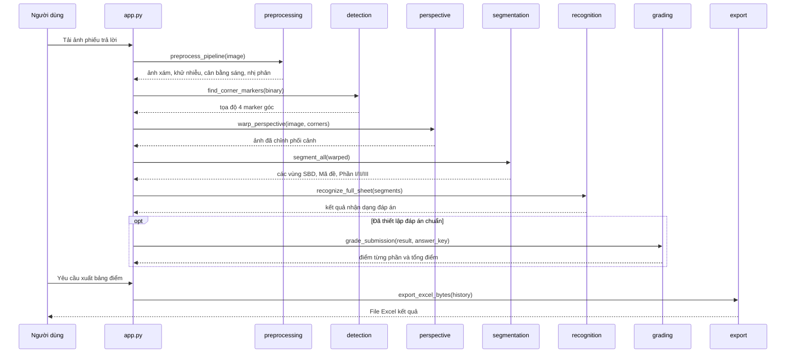

# Hệ thống OMR - Chấm điểm trắc nghiệm tự động

> Hệ thống nhận dạng và chấm điểm tự động phiếu trả lời trắc nghiệm dạng THPT bằng xử lý ảnh truyền thống (OpenCV), không sử dụng Machine Learning.

## Mục lục

- [Hệ thống OMR - Chấm điểm trắc nghiệm tự động](#hệ-thống-omr---chấm-điểm-trắc-nghiệm-tự-động)
  - [Mục lục](#mục-lục)
  - [Giới thiệu](#giới-thiệu)
  - [Phát Biểu Mục Tiêu / Giả Thuyết](#phát-biểu-mục-tiêu--giả-thuyết)
  - [Tính năng chính](#tính-năng-chính)
  - [Công nghệ sử dụng](#công-nghệ-sử-dụng)
  - [Lý do lựa chọn công nghệ](#lý-do-lựa-chọn-công-nghệ)
    - [So sánh Adaptive Threshold và Otsu](#so-sánh-adaptive-threshold-và-otsu)
  - [Kiến trúc tổng thể](#kiến-trúc-tổng-thể)
  - [Chi tiết pipeline xử lý](#chi-tiết-pipeline-xử-lý)
  - [Cấu trúc thư mục](#cấu-trúc-thư-mục)
  - [Luồng hoạt động](#luồng-hoạt-động)
  - [Yêu cầu hệ thống](#yêu-cầu-hệ-thống)
  - [Cài đặt](#cài-đặt)
  - [Chạy dự án](#chạy-dự-án)
  - [Hướng dẫn sử dụng](#hướng-dẫn-sử-dụng)

## Giới thiệu

Dự án xây dựng một pipeline xử lý ảnh hoàn chỉnh nhằm tự động hóa việc chấm bài thi trắc nghiệm dạng phiếu trả lời chuẩn THPT (3 phần: trắc nghiệm A/B/C/D, Đúng/Sai, điền số). Bài toán giải quyết: từ một ảnh chụp/scan phiếu trả lời, hệ thống tự động phát hiện, chỉnh phối cảnh, phân đoạn từng vùng câu hỏi, nhận dạng ô được tô và tính điểm dựa trên đáp án chuẩn, thay thế cho việc chấm thủ công.

Toàn bộ pipeline nhận dạng sử dụng các thuật toán xử lý ảnh cổ điển (threshold thích ứng, phát hiện contour, Hough Circle, v.v.) thông qua OpenCV, không dùng mô hình học máy.

## Phát Biểu Mục Tiêu / Giả Thuyết

**Vấn đề:** Chấm bài thi trắc nghiệm THPT (3 phần: A/B/C/D, Đúng/Sai, điền số) từ ảnh chụp điện thoại của phiếu trả lời, thay thế hoàn toàn việc chấm thủ công.

**Giả thuyết:** Chúng tôi dự đoán rằng pipeline xử lý ảnh truyền thống (Adaptive Threshold + Contour Detection + Hough Circle) đạt độ chính xác nhận dạng ô tô ≥ 90% trên ảnh chụp điện thoại trong điều kiện ánh sáng thông thường, vì cấu trúc phiếu trả lời cố định và đã biết trước cho phép xác định vùng xử lý chính xác mà không cần học máy. Cụ thể, Adaptive Threshold sẽ cho kết quả nhị phân hóa tốt hơn Otsu trên ảnh có ánh sáng không đều (bóng đổ, góc chụp lệch), vì ngưỡng được tính cục bộ thay vì toàn cục.

**Tiêu chí thành công:**
- Độ chính xác nhận dạng ô tô (per-bubble accuracy) ≥ 90% trên tập kiểm thử ≥ 10 phiếu thực tế.
- Sai lệch điểm so với chấm tay ≤ 0.5 điểm trên thang 10 ở ≥ 85% số bài.
- Adaptive Threshold cho per-bubble accuracy cao hơn Otsu ≥ 5% trên ảnh chụp điện thoại (đo trên cùng tập dữ liệu).

## Tính năng chính

- Tiền xử lý ảnh: chuyển xám, khử nhiễu, cân bằng sáng (CLAHE), nhị phân hóa thích ứng
- Phát hiện 4 marker góc và chỉnh phối cảnh (perspective warp) để chuẩn hóa khung ảnh
- Phân đoạn tự động các vùng: Số báo danh (SBD), Mã đề, Phần I, Phần II, Phần III
- Nhận dạng ô tô đáp án bằng phát hiện hình tròn và tỉ lệ lấp đầy (fill ratio)
- Chấm điểm theo thang điểm THPT (Phần I: 4 điểm, Phần II: 4 điểm có điểm thành phần, Phần III: 2 điểm)
- Giao diện web trực quan (Streamlit) với 3 trang: Dashboard, Chấm bài, Kết quả
- Nhập đáp án chuẩn qua file Excel/JSON hoặc nhập tay
- Xuất bảng điểm tổng hợp ra file Excel
- Chế độ debug: xuất ảnh trung gian của từng bước xử lý để kiểm tra

## Công nghệ sử dụng

| Thành phần | Công nghệ |
|---|---|
| Ngôn ngữ | Python |
| Xử lý ảnh | OpenCV (opencv-python), imutils |
| Tính toán mảng | NumPy |
| Giao diện web | Streamlit |
| Xử lý dữ liệu / bảng điểm | Pandas |
| Xuất file Excel | openpyxl |

## Lý do lựa chọn công nghệ

| Công nghệ | Lý do chọn |
|---|---|
| OpenCV | Cung cấp đầy đủ các thuật toán xử lý ảnh cổ điển cần thiết (threshold, contour, Hough Circle) mà không cần huấn luyện mô hình, phù hợp bài toán OMR có cấu trúc phiếu cố định |
| Adaptive Threshold (thay vì Otsu) | Ảnh phiếu trả lời được chụp bằng điện thoại nên ánh sáng không đều giữa các vùng (bóng đổ, góc chụp). Adaptive Threshold tính ngưỡng nhị phân hóa cục bộ theo từng vùng nhỏ, chống chịu tốt hơn với chênh lệch ánh sáng so với Otsu vốn dùng một ngưỡng toàn cục |
| CLAHE | Cân bằng sáng cục bộ trước khi nhị phân hóa, giảm ảnh hưởng của vùng sáng/tối không đều trên ảnh chụp |
| imutils | Rút gọn các thao tác OpenCV thường dùng (resize, sắp xếp contour) |
| Streamlit | Dựng giao diện web demo nhanh, phù hợp trình bày pipeline xử lý ảnh theo từng bước mà không cần viết frontend riêng |
| Pandas | Xử lý và hiển thị dữ liệu bảng điểm, thống kê |
| openpyxl | Đọc/ghi file Excel cho đáp án chuẩn và bảng điểm xuất ra |
| SQLite | Lưu trữ nhẹ, không cần server riêng, phù hợp quy mô ứng dụng demo/đồ án |

### So sánh Adaptive Threshold và Otsu

Module `preprocessing.py` hỗ trợ cả hai phương pháp nhị phân hóa (tham số `method` trong hàm `binarize`), nhưng pipeline mặc định (`preprocess_pipeline`) sử dụng **Adaptive Threshold**.

| Tiêu chí | Adaptive Threshold (đang dùng) | Otsu |
|---|---|---|
| Cách tính ngưỡng | Cục bộ theo từng vùng nhỏ của ảnh | Toàn cục, một ngưỡng duy nhất theo histogram |
| Chịu ánh sáng không đều | Tốt — phù hợp ảnh chụp điện thoại có bóng đổ | Kém — dễ mất chi tiết ở vùng sáng/tối cực đoan |
| Tốc độ xử lý | Chậm hơn Otsu | Nhanh hơn |
| Phù hợp | Ảnh chụp thực tế, điều kiện ánh sáng thay đổi | Ảnh scan, ánh sáng đồng đều |

Do phiếu trả lời trong dự án chủ yếu được chụp bằng điện thoại thay vì scan, Adaptive Threshold được chọn làm mặc định để đảm bảo độ ổn định khi nhận dạng ô tô ở các vùng ảnh có độ sáng khác nhau. Otsu vẫn được giữ lại trong code như một lựa chọn thay thế, có thể dùng khi đầu vào là ảnh scan chất lượng cao và ánh sáng đồng đều.

## Kiến trúc tổng thể

Ứng dụng theo mô hình orchestration: `app.py` là lớp giao diện Streamlit, chỉ gọi tuần tự các hàm xử lý thuần túy nằm trong package `modules/`, không chứa logic xử lý ảnh.


## Chi tiết pipeline xử lý

Pipeline xử lý một ảnh phiếu trả lời gồm 6 giai đoạn tuần tự, mỗi giai đoạn tương ứng với một module trong `modules/`:

| Giai đoạn | Module | Đầu vào | Đầu ra |
|---|---|---|---|
| 1. Tiền xử lý | `preprocessing.py` | Ảnh gốc | Ảnh xám, khử nhiễu, cân bằng sáng, ảnh nhị phân |
| 2. Phát hiện marker | `detection.py` | Ảnh nhị phân | Tọa độ 4 marker góc |
| 3. Chỉnh phối cảnh | `perspective.py` | Ảnh gốc + tọa độ marker | Ảnh đã warp về khung chuẩn |
| 4. Phân đoạn vùng | `segmentation.py` | Ảnh đã warp | Các vùng cắt: SBD, Mã đề, Phần I/II/III |
| 5. Nhận dạng | `recognition.py` | Các vùng đã cắt | Kết quả đáp án (SBD, mã đề, phần I/II/III) |
| 6. Chấm điểm (tùy chọn) | `grading.py` | Kết quả nhận dạng + đáp án chuẩn | Điểm từng phần và tổng điểm |

Kết quả chấm điểm sau đó được lưu vào SQLite qua `database.py` và có thể xuất ra Excel qua `export.py`.



## Cấu trúc thư mục

```
omr_project-main/
├── app.py                 # Giao diện web Streamlit (Dashboard, Chấm bài, Kết quả)
├── main.py                # Entry point dự phòng
├── requirements.txt        # Danh sách thư viện phụ thuộc
├── modules/                 # Package lõi chứa toàn bộ pipeline xử lý ảnh
│   ├── preprocessing.py     # Tiền xử lý ảnh (grayscale, denoise, equalize, binarize)
│   ├── detection.py          # Phát hiện marker 4 góc của phiếu
│   ├── perspective.py       # Chỉnh phối cảnh (warp) ảnh về khung chuẩn
│   ├── segmentation.py      # Phân đoạn vùng SBD, Mã đề, Phần I/II/III
│   ├── recognition.py        # Nhận dạng ô tô đáp án
│   ├── grading.py             # Chấm điểm theo đáp án chuẩn
│   └── export.py               # Xuất bảng điểm ra Excel, đọc file đáp án chuẩn
└── input/                     # Ảnh mẫu phiếu trả lời dùng để thử nghiệm
```

## Luồng hoạt động

Toàn bộ xử lý một ảnh phiếu trả lời đi qua các bước tuần tự sau (được điều phối bởi hàm `process_image` trong `app.py`):



## Yêu cầu hệ thống

- Python 3.x
- pip
- Các thư viện liệt kê trong `requirements.txt`: `opencv-python`, `numpy`, `imutils`, `streamlit`, `pandas`, `openpyxl`

## Cài đặt

```powershell
# Tạo và kích hoạt môi trường ảo (khuyến nghị)
python -m venv venv
venv\Scripts\activate

# Cài đặt các thư viện phụ thuộc
pip install -r requirements.txt
```

## Chạy dự án

```powershell
streamlit run app.py
```

Ứng dụng sẽ khởi chạy trên trình duyệt tại địa chỉ mặc định của Streamlit (thường là `http://localhost:8501`).

## Hướng dẫn sử dụng

1. Mở trang **Chấm bài**, thiết lập đáp án chuẩn (tùy chọn) bằng cách tải file Excel/JSON hoặc nhập tay.
2. Tải lên ảnh phiếu trả lời trắc nghiệm (định dạng jpg, jpeg, png).
3. Nhấn **Thực hiện chấm bài** để hệ thống chạy toàn bộ pipeline và hiển thị từng bước xử lý cùng kết quả nhận dạng.
4. Nếu đã có đáp án chuẩn, điểm số theo từng phần và tổng điểm sẽ được tính và lưu vào lịch sử.
5. Vào trang **Kết quả** để xem bảng tổng hợp các bài đã chấm và tải về file Excel bảng điểm.
6. Trang **Dashboard** hiển thị số liệu thống kê tổng quan: số bài đã chấm, điểm trung bình, cao nhất, thấp nhất và phân bố điểm.****