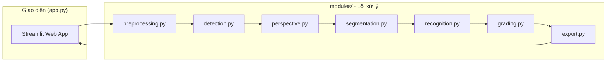
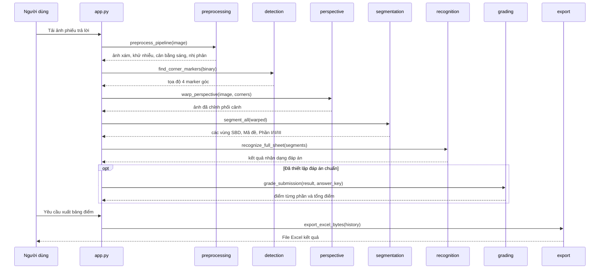

# Hệ thống OMR - Chấm điểm trắc nghiệm tự động

> Hệ thống nhận dạng và chấm điểm tự động phiếu trả lời trắc nghiệm dạng THPT bằng xử lý ảnh truyền thống (OpenCV), không sử dụng Machine Learning.

## Mục lục

- [Hệ thống OMR - Chấm điểm trắc nghiệm tự động](#hệ-thống-omr---chấm-điểm-trắc-nghiệm-tự-động)
  - [Mục lục](#mục-lục)
  - [Giới thiệu](#giới-thiệu)
  - [Tính năng chính](#tính-năng-chính)
  - [Công nghệ sử dụng](#công-nghệ-sử-dụng)
  - [Kiến trúc tổng thể](#kiến-trúc-tổng-thể)
  - [Cấu trúc thư mục](#cấu-trúc-thư-mục)
  - [Luồng hoạt động](#luồng-hoạt-động)
  - [Yêu cầu hệ thống](#yêu-cầu-hệ-thống)
  - [Cài đặt](#cài-đặt)
  - [Chạy dự án](#chạy-dự-án)
  - [Hướng dẫn sử dụng](#hướng-dẫn-sử-dụng)

## Giới thiệu

Dự án xây dựng một pipeline xử lý ảnh hoàn chỉnh nhằm tự động hóa việc chấm bài thi trắc nghiệm dạng phiếu trả lời chuẩn THPT (3 phần: trắc nghiệm A/B/C/D, Đúng/Sai, điền số). Bài toán giải quyết: từ một ảnh chụp/scan phiếu trả lời, hệ thống tự động phát hiện, chỉnh phối cảnh, phân đoạn từng vùng câu hỏi, nhận dạng ô được tô và tính điểm dựa trên đáp án chuẩn, thay thế cho việc chấm thủ công.

Toàn bộ pipeline nhận dạng sử dụng các thuật toán xử lý ảnh cổ điển (threshold thích ứng, phát hiện contour, Hough Circle, v.v.) thông qua OpenCV, không dùng mô hình học máy.

## Tính năng chính

- Tiền xử lý ảnh: chuyển xám, khử nhiễu, cân bằng sáng (CLAHE), nhị phân hóa thích ứng
- Phát hiện 4 marker góc và chỉnh phối cảnh (perspective warp) để chuẩn hóa khung ảnh
- Phân đoạn tự động các vùng: Số báo danh (SBD), Mã đề, Phần I, Phần II, Phần III
- Nhận dạng ô tô đáp án bằng phát hiện hình tròn và tỉ lệ lấp đầy (fill ratio)
- Chấm điểm theo thang điểm THPT (Phần I: 4 điểm, Phần II: 4 điểm có điểm thành phần, Phần III: 2 điểm)
- Giao diện web trực quan (Streamlit) với 3 trang: Dashboard, Chấm bài, Kết quả
- Nhập đáp án chuẩn qua file Excel/JSON hoặc nhập tay
- Xuất bảng điểm tổng hợp ra file Excel
- Chế độ debug: xuất ảnh trung gian của từng bước xử lý để kiểm tra

## Công nghệ sử dụng

| Thành phần | Công nghệ |
|---|---|
| Ngôn ngữ | Python |
| Xử lý ảnh | OpenCV (opencv-python), imutils |
| Tính toán mảng | NumPy |
| Giao diện web | Streamlit |
| Xử lý dữ liệu / bảng điểm | Pandas |
| Xuất file Excel | openpyxl |

## Kiến trúc tổng thể

Ứng dụng theo mô hình orchestration: `app.py` là lớp giao diện Streamlit, chỉ gọi tuần tự các hàm xử lý thuần túy nằm trong package `modules/`, không chứa logic xử lý ảnh.



## Cấu trúc thư mục

```
omr_project-main/
├── app.py                 # Giao diện web Streamlit (Dashboard, Chấm bài, Kết quả)
├── main.py                # Entry point dự phòng
├── requirements.txt        # Danh sách thư viện phụ thuộc
├── modules/                 # Package lõi chứa toàn bộ pipeline xử lý ảnh
│   ├── preprocessing.py     # Tiền xử lý ảnh (grayscale, denoise, equalize, binarize)
│   ├── detection.py          # Phát hiện marker 4 góc của phiếu
│   ├── perspective.py       # Chỉnh phối cảnh (warp) ảnh về khung chuẩn
│   ├── segmentation.py      # Phân đoạn vùng SBD, Mã đề, Phần I/II/III
│   ├── recognition.py        # Nhận dạng ô tô đáp án
│   ├── grading.py             # Chấm điểm theo đáp án chuẩn
│   └── export.py               # Xuất bảng điểm ra Excel, đọc file đáp án chuẩn
└── input/                     # Ảnh mẫu phiếu trả lời dùng để thử nghiệm
```

## Luồng hoạt động

Toàn bộ xử lý một ảnh phiếu trả lời đi qua các bước tuần tự sau (được điều phối bởi hàm `process_image` trong `app.py`):



## Yêu cầu hệ thống

- Python 3.x
- pip
- Các thư viện liệt kê trong `requirements.txt`: `opencv-python`, `numpy`, `imutils`, `streamlit`, `pandas`, `openpyxl`

## Cài đặt

```powershell
# Tạo và kích hoạt môi trường ảo (khuyến nghị)
python -m venv venv
venv\Scripts\activate

# Cài đặt các thư viện phụ thuộc
pip install -r requirements.txt
```

## Chạy dự án

```powershell
streamlit run app.py
```

Ứng dụng sẽ khởi chạy trên trình duyệt tại địa chỉ mặc định của Streamlit (thường là `http://localhost:8501`).

## Hướng dẫn sử dụng

1. Mở trang **Chấm bài**, thiết lập đáp án chuẩn (tùy chọn) bằng cách tải file Excel/JSON hoặc nhập tay.
2. Tải lên ảnh phiếu trả lời trắc nghiệm (định dạng jpg, jpeg, png).
3. Nhấn **Thực hiện chấm bài** để hệ thống chạy toàn bộ pipeline và hiển thị từng bước xử lý cùng kết quả nhận dạng.
4. Nếu đã có đáp án chuẩn, điểm số theo từng phần và tổng điểm sẽ được tính và lưu vào lịch sử.
5. Vào trang **Kết quả** để xem bảng tổng hợp các bài đã chấm và tải về file Excel bảng điểm.
6. Trang **Dashboard** hiển thị số liệu thống kê tổng quan: số bài đã chấm, điểm trung bình, cao nhất, thấp nhất và phân bố điểm.****